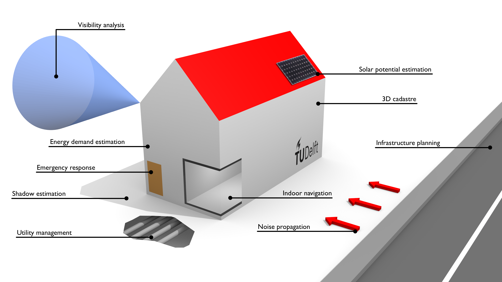

## Use cases of 3D city models

3D city models are nowadays used for many different applications across a multitude of application domains.  

{: width="800px"}  

We have researched the state of the art of the application of 3D city models, and published it in the following paper (open access):

Biljecki F, Stoter J, Ledoux H, Zlatanova S, and Çöltekin A (2015). Applications of 3D City Models: State of the Art Review. *ISPRS International Journal of Geo-Information*, 4(4): 2842-2889. DOI: [10.3390/ijgi4042842](http://doi.org/10.3390/ijgi4042842)

In summary, we have found 29 use cases in which 3D city models provide added value:

| Use case | Example of an application |
| --- | --- |
| Estimation of the solar irradiation | Determining the suitability of a roof surface for installing photovoltaic panels |
| Energy demand estimation | Assessing the return of a building energy retrofit
| Aiding positioning | Map matching |
| Determination of the floorspace | Valuation of buildings | |
| Classifying building types | Semantic enrichment of data sets |
| Geo-visualisation and visualisation enhancement | Flight simulation |
| Visibility analysis | Finding the optimal location to place a surveillance camera |
| Estimation of shadows cast by urban features | Determination of solar envelopes |
| Estimation of the propagation of noise in an urban environment | Traffic planning |
| 3D cadastre | Property registration |
| Visualisation for navigation | Navigation |
| Urban planning | Designing green areas |
| Visualisation for communication of urban information to citizenry | Virtual tours |
| Reconstruction of sunlight direction | Object recognition |
| Understanding SAR images | Interpretation of radar data |
| Facility management | Managing utilities |
| Automatic scaffold assembly | Civil engineering |
| Emergency response | Planning evacuation |
| Lighting simulations | Planning lighting of landmarks |
| Radio-wave propagation | Optimising radio infrastructure |
| Computational fluid dynamics | Predicting air quality |
| Estimating the population in an area | Crisis management |
| Routing | Understanding accessibility |
| Forecasting seismic damage | Insurance |
| Flooding | Mitigating damage to utility management |
| Change detection | Urban inventory |
| Volumetric density studies | Urban studies |
| Forest management | Predicting tree growth |
| Archaeology | Visualising ancient sites |

 

For the full description and references please [read the paper](http://doi.org/10.3390/ijgi4042842).