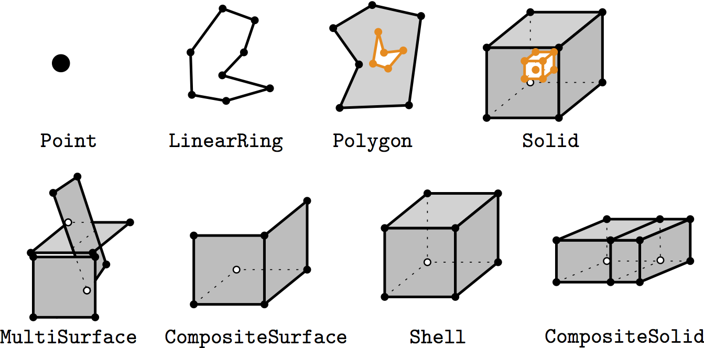
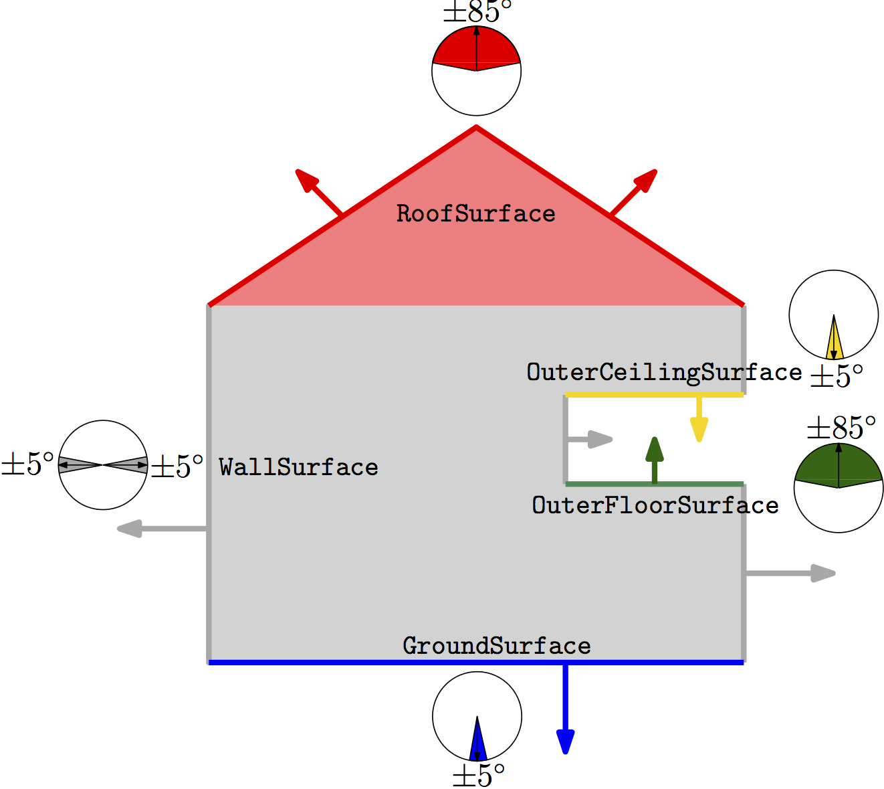

# Validation of CityGML files

Validation of a CityGML dataset means that one must ensure that it respects the standardised specifications and definitions as given in the [OGC City Geography Markup Language (CityGML) En- coding Standard (OGC document 12-019)](https://portal.opengeospatial.org/files/?artifact_id=47842).

In 2014-2015, The OGC ran the the *CityGML Quality Interoperability Experiment*, whose main goals were to define data quality requirements for a general CityGML data specification, to provide recommended implementation guidance for 3D data, and to provide a suite of essential quality checking tools to carry out quality assurance on CityGML data.
Its [final report is available online](https://portal.opengeospatial.org/files/?artifact_id=68821).

Six aspects of data quality were identified:
  

  

    

      <a href="#schema-conformance" class="list-group-item list-group-item-info text-center">Schema conformance</a>
      <a href="#geometry" class="list-group-item list-group-item-info text-center">Geometry</a>
      <a href="#semantics" class="list-group-item list-group-item-info text-center">Semantics</a>
    

  

  

    

      <a href="#conformance-requirements" class="list-group-item list-group-item-info text-center">Conformance requirements</a>
      <a href="#resolvability-of-xlinks" class="list-group-item list-group-item-info text-center">Resolvability of XLinks</a>
      <a href="#application-specific-rules" class="list-group-item list-group-item-info text-center">Application-specific rules</a>
    

  

- - - 

## 1. Schema conformance

Tools for XML Schema validation, i.e. the GML/XML files against the [XSD files of CityGML](/doc/) are readily available and give reliable results. 
Some generic examples are (which can be used to validate any XML document):

  - [Apache Xerces](http://xerces.apache.org) 
  - [oXygen](http://oxygenxml.com)
  - [Altova XMLSpy](https://www.altova.com/xmlspy.html)

The TU Delft offers a [free web-application to validate the schema of a CityGML file](http://geovalidation.bk.tudelft.nl/schemacitygml/), simply upload your file and you get the answer.

- - - 

## 2. Geometry

CityGML, and GML, use the [ISO 19107](http://www.iso.org/iso/catalogue_detail.htm?csnumber=26012) geometric primitives for representing the geometry of its objects: a 0D primitive is a `GM_Point`, a 1D a `GM_Curve`, a 2D a `GM_Surface`, and a 3D a `GM_Solid`.
A *d*-dimensional primitive is built with (*d-1*)-dimensional primitives, e.g. a `GM_Solid` is formed by several `GM_Surfaces`, which are formed of several `GM_Curves`, which are themselves formed of `GM_Point`.
While the ISO19107 primitives do not need to be linear or planar, i.e. curves defined by mathematical functions are allowed, CityGML uses a subset of ISO19107, with the following two restrictions: (1) `GM_Curves` can only be linear (thus only `LineStrings` and `LinearRings` are used); (2) `GM_Surfaces` can only be planar (thus `Polygons` are used).

{: width="400px"}

Geometric primitives can be combined into either *aggregates* or *composites*.
An aggregate is an arbitrary collection of primitives of same dimensionality that is simply used to bundle together geometries, it does not prescribe any topological relationships between the primitives.
The `Multi*` in CityGML are an example.
A composite of dimension *d* is a collection of *d*-dimensional primitives that form a *d*-manifold, which is a topological space that is locally like a *d*-dimensional Euclidean space. 
The most relevant example is `CompositeSurface`: it is a 2-manifold, or, in other words, a surface embedded in 3D space.

A valid primitive of dimension 3 means that all the lower-dimensional primitives used to represent the primitives are also valid.

The following software allows one to validate the primitives of CityGML:

  - [val3dity](https://github.com/tudelft3d/val3dity): TU Delft free and open-source validator for 3D primitives. It is ISO 19017 compliant, but composites and aggregates are not handled. There is also a [simple-to-use web application](http://geovalidation.bk.tudelft.nl/val3dity/)
  - [CityDoctor](http://www.citydoctor.eu) can validate 3D primitives, but inner rings and inner shells in 3D primitives are not handled, and neither are composites and aggregates. It however allows us to perform some automatic repair operations when a primitive is invalid.

- - - 

## 3. Semantics

The objects in CityGML can have semantics attached to them, for instance each of the surfaces used to represent a building can be a semantic class (`BoundarySurface`}), which defines its real-world meaning.
Depending on the LOD, a `BoundarySurface` in a building can be one of nine classes.
For LOD2 buildings, the 5 possible ones are shown in below.

{: width="400px"}

While it is impossible to validate with 100% certainty the semantic of the surfaces of a building, it is possible to infer it from the orientation of a surface.
The QIE used that methodology, and the software [CityDoctor](http://www.citydoctor.eu) implements that method.

- - - 

## 4. Conformance requirements 

This means: the translation of requirements stated in natural language into verifiable functions.

- - - 

## 5. Resolvability of XLinks

XLinks are extensively used in CityGML files, since they allow us to reuse surfaces.
See for instance the [page about examples of buildings](/exampleclasses/building/), and for instance [this example](/exampleclasses/building/b1_lod2_s_w_sem.gml).

We have noticed that several tools and XML parsers do not resolve XLinks, and thus a valid file could be misinterpreted.

All tools above should be able to do this, but unfortunately it is not the case.

- - - 

## 6. Application-specific rules 

The generic use cases to be explored are the creation and maintenance of CityGML
models for national and regional mapping including visualization, and analysis such as:

* Line of sight;
* Shading;
* Flooding;
* Aggregation of floorspace for buildings/sites;
* Energy demand simulation; and
* Scenario evaluation in urban planning.

One example is that a building is required to have a ground floor to form a volume (which is, surprisingly, not mandatory in CityGML)

